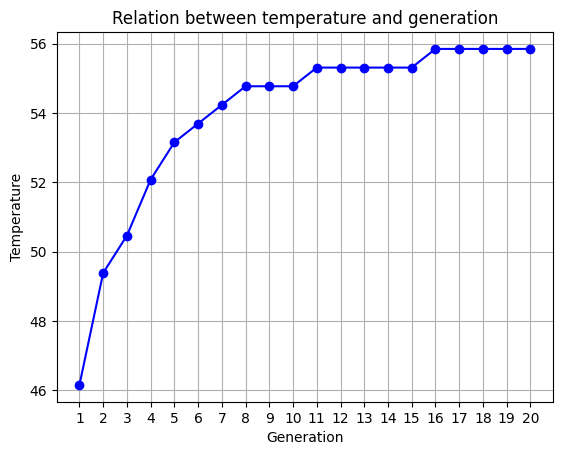
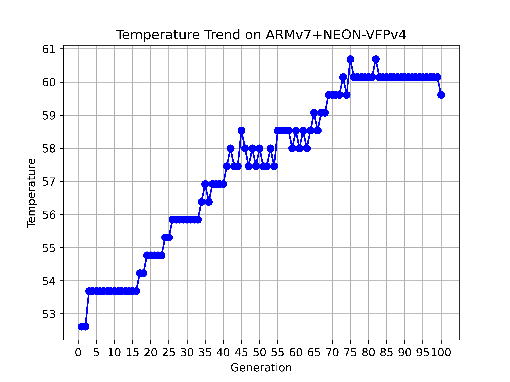

# 好烧好烧的 CPU 🥵🥵🥵

## 实验 0

已知在某一天不同时间点测量 CPU 温度会有明显区别，建议放在同一时间段进行测试．

为了保证减少重复运行带来的温度误差，在完成了一次测试、即将开始下一次测试前进行如下准备工作：

```sh
$ ps -a # 检查当前是否有其他进程运行，如上次测试未结束的 individual 进程
$ pkill individual  # 杀死未结束的 individual 进程
$ cat /sys/class/thermal/thermal_zone0/temp # 多次检查 CPU 温度，直到温度低于 45 度认为完成冷却
```

## 实验 1

运行指令 `taskset` 来决定在哪个 CPU 核上运行。因此我们只需要修改 `genetic_algorithm.py` 中 `measure_temperature` 函数的运行指令即可。

如单核运行时，修改函数为：

```python
# 编译指令文件并测量温度
def measure_temperature():
    subprocess.run(["gcc", NEW_INSTRUCTION_FILE, "-o", "individual"])
    subprocess.run('taskset -c 0 ./individual &', shell=True)
    time.sleep(Running_Time)
    subprocess.run(["killall individual"], shell=True)
    temperature_output = subprocess.check_output(TEMPERATURE_COMMAND, shell=True)
    temperature = float(temperature_output) / 1000.0
    subprocess.run(["rm -f individual"], shell=True)
    return temperature
```

为了防止连续运行带来的温度误差，每次运行完任务之后让服务器等待 5 min 以上再进行下一个测试。

`Best Temperature` 与运行核数目的关系如下：

|      | 1 个核 | 2 个核 | 3 个核 | 4 个核 |
| ---- | ------ | ------ | ------ | ------ |
| 温度 | 44.546 | 46.698 | 48.85  | 52.616 |

迭代次数和温度的关系如下图：


## 实验 2

在绑定四核运行的前提下，不同参数下的处理器温度情况如下表所示：

| 每代种群数量 | 温度   | 迭代次数 | 温度   | 指令长度 | 温度   |
| ------------ | ------ | -------- | ------ | -------- | ------ |
| 10           | 54.230 | 20       | 55.844 | 10       | 58.534 |
| 20           | 55.844 | 40       | 57.996 | 20       | 56.920 |
| 30           | 56.382 | 60       | 57.996 | 30       | 56.920 |
| 40           | 56.382 | 80       | 59.072 | 40       | 57.458 |
| 50           | 56.920 | 100      | 59.610 | 50       | 57.458 |

改变不同参数时，遗传算法运行时温度迭代趋势图如下：

**每代种群数量**


**迭代次数**


**指令长度**


## 实验 3

修改如下：

指令集添加了

```xml
<instruction>
    <opcode>mov</opcode>
    <operands>
        <operand>vreg1</operand>
        <operand>vreg2</operand>
    </operands>
</instruction>


<instruction>
    <opcode>cmp</opcode>
    <operands>
        <operand>reg1</operand>
        <operand>reg2</operand>
    </operands>
</instruction>

<instruction>
    <opcode>cmp</opcode>
    <operands>
        <operand>vreg1</operand>
        <operand>vreg2</operand>
    </operands>
</instruction>

<!-- 使用乘法器的指令 -->
<instruction>
    <opcode>mul</opcode>
    <operands>
        <operand>reg1</operand>
        <operand>reg2</operand>
        <operand>reg3</operand>
    </operands>
</instruction>

<instruction>
    <opcode>mul</opcode>
    <operands>
        <operand>vreg1</operand>
        <operand>vreg2</operand>
        <operand>vreg3</operand>
    </operands>
</instruction>

<instruction>
    <opcode>vadd.f64</opcode>
    <operands>
        <operand>dreg1</operand>
        <operand>dreg2</operand>
        <operand>dreg3</operand>
    </operands>
</instruction>

<instruction>
    <opcode>vsub.f64</opcode>
    <operands>
        <operand>dreg1</operand>
        <operand>dreg2</operand>
        <operand>dreg3</operand>
    </operands>
</instruction>

<instruction>
    <opcode>vmul.f64</opcode>
    <operands>
        <operand>dreg1</operand>
        <operand>dreg2</operand>
        <operand>dreg3</operand>
    </operands>
</instruction>

<instruction>
    <opcode>vcmp.f64</opcode>
    <operands>
        <operand>dreg1</operand>
        <operand>dreg2</operand>
    </operands>
</instruction>

<instruction>
    <opcode>vcmpe.f64</opcode>
    <operands>
        <operand>dreg1</operand>
        <operand>dreg2</operand>
    </operands>
</instruction>
```

运行参数修改为：

```python
# 遗传算法参数
POPULATION_SIZE = 50  # 每一代种群数量
MAX_GENERATIONS = 20  # 最大迭代次数
CROSSOVER_RATE = 0.7  # 交叉概率
MUTATION_RATE = 0.1  # 变异概率
ELITISM_RATE = 0.2  # 精英保留比例

# 指令相关参数
INSTRUCTION_LENGTH = 10  # 指令序列长度
```

在准备完成之后运行指令

```shell
python3 genetic_algorithm.py
```

|              | 最高温度值 |
| ------------ | ---------- |
| 扩展指令集前 | 58.534     |
| 扩展指令集后 | 60.686     |


可以看到由于添加了浮点向量指令等等更为复杂的运算指令，运行温度有所提高。

## 实验 4

在本实验中，我们小组分工进行了不同方向的尝试，并且得到了三个版本的代码，经过比较权衡之后上交了第一个版本 **遗传算法参数优化 + 手动构造**。

最终指令如下：

```arm
mov      r7 ,r2
vmul.f64 d4 ,d4 ,d15
mov      r12 ,#154
mov      r8 ,r0
vmul.f64 d3 ,d2 ,d11
ldr      r11 ,[r13]
add      v4 ,v3 ,v4
add      r0 ,r6 ,r7
cmp      v3 ,v5
ldr      r9 ,[r13]
```

但是也会将每个版本的思路和结果都报告在下图中。

### 遗传算法参数优化 + 手动构造

#### 结果

在足够冷却了 CPU 的情况下测量 `example4.s` 的运行温度为 **56.947 ℃**。

初始化之后，进行这部分代码序列的测试，运行 `temperature_test.py`，得到结果为 **60.148 ℃**。

使用遗传算法迭代：

```python
# 遗传算法参数
POPULATION_SIZE = 100  # 每一代种群数量
MAX_GENERATIONS = 20  # 最大迭代次数
CROSSOVER_RATE = 0.7  # 交叉概率
MUTATION_RATE = 0.1  # 变异概率
ELITISM_RATE = 0.2  # 精英保留比例

# 指令相关参数
INSTRUCTION_LENGTH = 10  # 指令序列长度

# 获取一个寄存器
# 为了保证流水线尽可能不阻塞，我们希望尽可能使用不同的寄存器，即每次获得的寄存器可以是相邻的
def get_register():
    global NOW_GENERAL_REGISTER
    NOW_GENERAL_REGISTER = (NOW_GENERAL_REGISTER + 1) % 13
    return f"r{NOW_GENERAL_REGISTER}"

# 获取一个 SIMD 寄存器
def get_simd_register():
    global NOW_SIMD_REGISTER
    NOW_SIMD_REGISTER = (NOW_SIMD_REGISTER + 1) % 8
    return f"v{NOW_SIMD_REGISTER + 1}"
```

得到如下指令：

```arm
mov      r7 ,r2
vmul.f64 d4 ,d4 ,d15
mov      r12 ,#154
mov      r8 ,r0
mul      r3, r2, r1
ldr      r11 ,[r13]
add      v4 ,v3 ,v4
mov      r0 ,r6
cmp      v3 ,v5
ldr      r9 ,[r13]
```

观察之后，感觉还可以进行优化。

优化思路如下：

- 将普通整数操作修改为浮点数操作，提高计算复杂性
- 逻辑比较指令相比于运算指令耗能较低，因此手动更改为整数运算指令

因此手动修改构造，得到

```arm
mov      r7 ,r2
vmul.f64 d4 ,d4 ,d15
mov      r12 ,#154
mov      r8 ,r0
vmul.f64 d3 ,d2 ,d11
ldr      r11 ,[r13]
add      v4 ,v3 ,v4
add      r0 ,r6 ,r7
cmp      v3 ,v5
ldr      r9 ,[r13]
```

初始化之后，进行测试，运行 `temperature_test.py`，得到结果为 60.148 ℃。

#### 优化思路

关键在于：

1. 在同一个流水线阶段使用不同的部件，避免资源冲突。
2. 令序列包含大量的计算密集型任务，是否要减少 IO 任务。
3. 提高指令序列的长度和复杂性，暴力提高运行时间。
4. 防止流水线停顿：让不同指令之间用到的寄存器尽可能分开，如第一个用 0, 1, 2，第二个用 3, 4, 5 以此类推。

遗传算法优化思路：

- 种群大小：更大的种群数目可以提供更多的指令基因多样性，从而覆盖更多可能。
- 指令长度：依据实验二测量结果和算法分析，当指令长度较长时，遗传算法的单条指令变异带来的影响很小，从而导致迭代优化效果不强。因此将指令长度设置为较短的 10。
- 精英保留概率：更多的精英保留有助于留住更多局部较优子结构，对流水线优化有好处。

手动构造由于不是主要内容，其修改思路已在上一部分简要阐述。

#### 温度迭代图



### ARMv7+NEON-VFPV4

在这一部分，我们探索了采用 ARMv7 指令集并开启 NEON 向量指令集扩展以及 VFPv4 浮点指令集扩展后，遗传算法生成指令序列的效果。

生成的指令序列如下：

```arm
adc      r2 ,r11 ,r11
vsub.d   d3 ,d31 ,d24
vcge.f   q3 ,q11 ,q0
str      r0 ,[r13]
vaba.u32 q12 ,q11 ,q5
adc      r9 ,r1 ,r4
vadd.f   q3 ,q4 ,q15
vbsl.f   q11 ,q8 ,q14
vzip.8   q9 ,q0
orr      r3 ,r11 ,r10
```

通过 `temperature_test.py` 进行测试，得到最高温度为 **60.148 ℃**。

由于 NEON 扩展引入了新的向量寄存器 `d0-d31` 与 `q0-q15`，我们需要在遗传算法中随机分配寄存器的部分增加对这些指令的处理。另外，我们也需要修改 `main.s`，使其使用 `armv7-a` 架构及 `neon-vfpv4` 浮点架构。为了支持向量存取指令，我们还分配了额外的栈空间。

```diff
@@ -1,4 +1,4 @@
-	.arch armv6
+	.arch armv7-a
 	.eabi_attribute 28, 1
 	.eabi_attribute 20, 1
 	.eabi_attribute 21, 1
@@ -13,10 +13,10 @@
 	.text
 	.align	2
 	.global	main
-	.arch armv6
+	.arch armv7-a
 	.syntax unified
 	.arm
-	.fpu vfp
+	.fpu neon-vfpv4
 	.type	main, %function
 main:
 	@ args = 0, pretend = 0, frame = 0
@@ -24,6 +24,7 @@
 	@ link register save eliminated.
 	str	fp, [sp, #-4]!
 	add	fp, sp, #0
+	add sp, sp, #400
 .L2:
 	.syntax divided
 @ 4 "main.c" 1
```

我们选取了部分向量浮点指令添加到 `instructions.xml` 中：

```arm
vadd.f
vadd.d
vmul.f
vmul.d
vsub.f
vsub.d
vdiv.d
vcmp.d
vqadd.s64
vmov
vbsl.f
vbsl.d
vcge.f
vmax.f
vaba.u32
vmlsq.f
vpmin.f
vqrdmulh.s32
vfma.f
vfma.d
vfnma.d
vacgt.f
vrecpe.f
vrsqrts.f
vcvt.s32.f32
vcvt.f32.s32
vrev64.8
vrev64.16
vrev64.32
vzip.8
vzip.16
vuzp.8
vuzp.16
vsqrt.d
vstmia.64
vldmia.64
```

采用和上一部分相同的参数运行遗传算法，得到如下指令序列：

```arm
adc      r2 ,r11 ,r11
vsub.d   d3 ,d31 ,d24
vcge.f   q3 ,q11 ,q0
str      r0 ,[r13]
vaba.u32 q12 ,q11 ,q5
adc      r9 ,r1 ,r4
vadd.f   q3 ,q4 ,q15
vbsl.f   q11 ,q8 ,q14
vzip.8   q9 ,q0
orr      r3 ,r11 ,r10
```

通过 `temperature_test.py` 进行测试，得到最高温度为 **60.148 ℃**。

指令扩展后的遗传算法温度迭代趋势图如下：



可以看到，尽管初始几轮迭代的温度相较于之前的版本较高，但添加的更多指令使得遗传算法需要耗费更多轮迭代才能够找到温度较高的指令序列。

我们注意到，最后选取的浮点指令中采用的都是 `vadd`、`vsub`、`vaba` (Vector Absolute Difference and Accumulate)、`vcge` (Vector Compare Greater than or Equal)、`vbsl` (Vector Bitwise Select)、`vzip` (Vector Zip) 等运算较为简单的加减、比较和逻辑运算指令，我们添加的较复杂的指令如 `vmul`、`vdiv`、`vqrdmulh` (Vector Saturating Rounding Doubling Multiply Returning High Half)、`vrsqrts` (Vector Reciprocal Square Root Step) 等都在遗传算法中被淘汰了，而向量访存指令 `vldm` (Extension Register Load Multiple)、`vstm` (Extension Register Store Multiple) 也没有被使用。我们推测这是因为较复杂的运算需要占用较长的周期，使得流水线被阻塞，功能部件没有得到充分利用。
