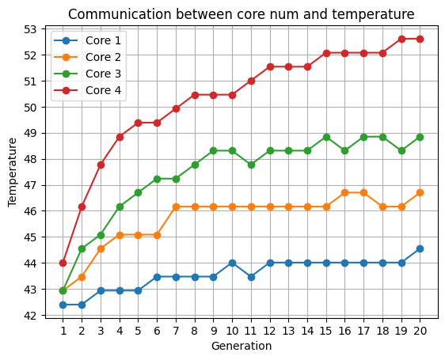
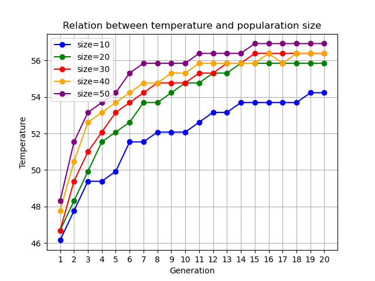
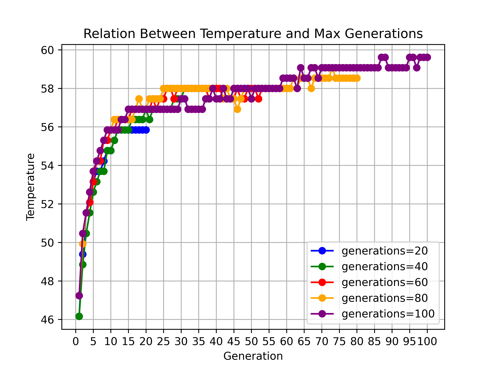
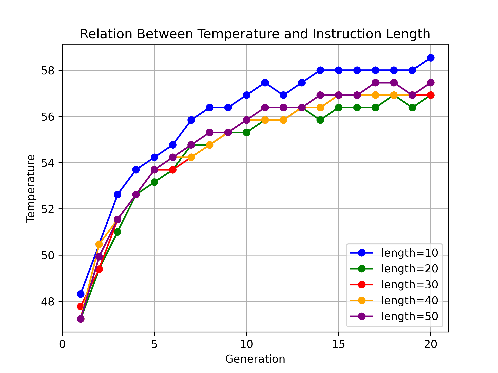
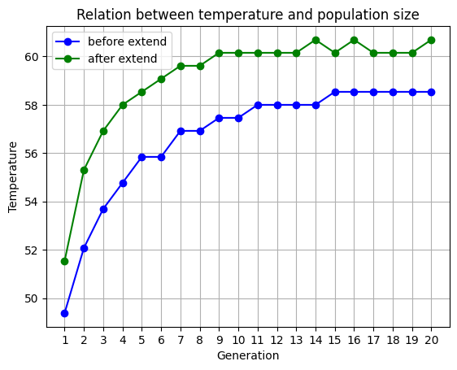

# 好烧好烧的 CPU 🥵🥵🥵

## 实验 0 

已知在某一天不同时间点测量 CPU 温度会有明显区别，建议放在同一时间段进行测试．

为了保证减少重复运行带来的温度误差，在完成了一次测试、即将开始下一次测试前进行如下准备工作：

```sh
$ ps -a # 检查当前是否有其他进程运行，如上次测试未结束的 individual 进程
$ pkill individual  # 杀死未结束的 individual 进程
$ cat /sys/class/thermal/thermal_zone0/temp # 多次检查 CPU 温度，直到温度低于 45 度认为完成冷却
```


## 实验 1

运行指令 `taskset` 来决定在哪个 CPU 核上运行。因此我们只需要修改 `genetic_algorithm.py` 中 `measure_temperature` 函数的运行指令即可。

如单核运行时，修改函数为：

```python
# 编译指令文件并测量温度
def measure_temperature():
    subprocess.run(["gcc", NEW_INSTRUCTION_FILE, "-o", "individual"])
    subprocess.run('taskset -c 0 ./individual &', shell=True)
    time.sleep(Running_Time)
    subprocess.run(["killall individual"], shell=True)
    temperature_output = subprocess.check_output(TEMPERATURE_COMMAND, shell=True)
    temperature = float(temperature_output) / 1000.0
    subprocess.run(["rm -f individual"], shell=True)
    return temperature
```


为了防止连续运行带来的温度误差，每次运行完任务之后让服务器等待 5 min 以上再进行下一个测试。

`Best Temperature` 与运行核数目的关系如下：

|     | 1 个核 | 2 个核 | 3 个核 | 4 个核 |
| --- | ------ | ------ | ----- | ------ |
| 温度 | 44.546 | 46.698 | 48.85 | 52.616 |

迭代次数和温度的关系如下图：



## 实验 2

在绑定四核运行的前提下，不同参数下的处理器温度情况如下表所示：

| 每代种群数量 | 温度    | 迭代次数 | 温度   | 指令长度 | 温度   |
|------------|--------|--------|--------|--------|--------|
|         10 | 54.230 |     20 | 55.844 |     10 | 58.534 |
|         20 | 55.844 |     40 | 57.996 |     20 | 56.920 |
|         30 | 56.382 |     60 | 57.996 |     30 | 56.920 |
|         40 | 56.382 |     80 | 59.072 |     40 | 57.458 |
|         50 | 56.920 |    100 | 59.610 |     50 | 57.458 |

改变不同参数时，遗传算法运行时温度迭代趋势图如下：

**每代种群数量**



**迭代次数**



**指令长度**



## 实验 3

修改如下：

指令集添加了

```xml
<instruction>
    <opcode>mov</opcode>
    <operands>
        <operand>vreg1</operand>
        <operand>vreg2</operand>
    </operands>
</instruction>


<instruction>
    <opcode>cmp</opcode>
    <operands>
        <operand>reg1</operand>
        <operand>reg2</operand>
    </operands> 
</instruction>

<instruction>
    <opcode>cmp</opcode>
    <operands>
        <operand>vreg1</operand>
        <operand>vreg2</operand>
    </operands>
</instruction>

<!-- 使用乘法器的指令 -->
<instruction>
    <opcode>mul</opcode>
    <operands>
        <operand>reg1</operand>
        <operand>reg2</operand>
        <operand>reg3</operand>
    </operands>
</instruction>

<instruction>
    <opcode>mul</opcode>
    <operands>
        <operand>vreg1</operand>
        <operand>vreg2</operand>
        <operand>vreg3</operand>
    </operands>
</instruction>
```

运行参数修改为：

```python
# 遗传算法参数
POPULATION_SIZE = 50  # 每一代种群数量
MAX_GENERATIONS = 20  # 最大迭代次数
CROSSOVER_RATE = 0.7  # 交叉概率
MUTATION_RATE = 0.1  # 变异概率
ELITISM_RATE = 0.2  # 精英保留比例

# 指令相关参数
INSTRUCTION_LENGTH = 10  # 指令序列长度
```

在准备完成之后运行指令

```shell
python3 genetic_algorithm.py
```





## 实验 4

在足够冷却了 CPU 的情况下测量 `example4.s` 的运行温度为 53.154 ℃。


关键在于：

1. 在同一个流水线阶段使用不同的部件，避免资源冲突。
2. 令序列包含大量的计算密集型任务，是否要减少 IO 任务
3. 提高指令序列的长度和复杂性，暴力提高运行时间
4. 防止流水线停顿：让不同指令之间用到的寄存器尽可能分开，如第一个用 012，第二个用 345 以此类推


使用遗传算法迭代：

```python
# 遗传算法参数
POPULATION_SIZE = 100  # 每一代种群数量
MAX_GENERATIONS = 50  # 最大迭代次数
CROSSOVER_RATE = 0.7  # 交叉概率
MUTATION_RATE = 0.1  # 变异概率
ELITISM_RATE = 0.2  # 精英保留比例

# 指令相关参数
INSTRUCTION_LENGTH = 10  # 指令序列长度

# 获取一个寄存器
# 为了保证流水线尽可能不阻塞，我们希望尽可能使用不同的寄存器，即每次获得的寄存器可以是相邻的
def get_register():
    global NOW_GENERAL_REGISTER
    NOW_GENERAL_REGISTER = (NOW_GENERAL_REGISTER + 1) % 13
    return f"r{NOW_GENERAL_REGISTER}"

# 获取一个 SIMD 寄存器
def get_simd_register():
    global NOW_SIMD_REGISTER
    NOW_SIMD_REGISTER = (NOW_SIMD_REGISTER + 1) % 8
    return f"v{NOW_SIMD_REGISTER + 1}"
```

得到如下指令：

```arm
and	r2 ,r3 ,r4
mul	r5 ,r6 ,r7
mov	r8 ,r9
mov	r7 ,#94
cmp	v4 ,v5
mov	v8 ,v1
add	v2 ,v3 ,v4
mov	r4 ,r5
cmp	v3 ,v4
add	v7 ,v8 ,v1
```

观察之后，感觉还可以进行优化，因此手动修改构造，得到

```arm
and	r2 ,r3 ,r4
mul	v5 ,v6 ,v7
ldr r8, [r13]
mov	r9 ,#94
cmp	v4 ,v5
add	v6 ,v7 ,v1
mul	r4 ,r5, r6
cmp	r9 ,r7
add	v8 ,v3 ,v2
str r10, [r13]
```


初始化之后，进行测试，运行 `temperature_test.py`，得到结果为 55.844 ℃。
